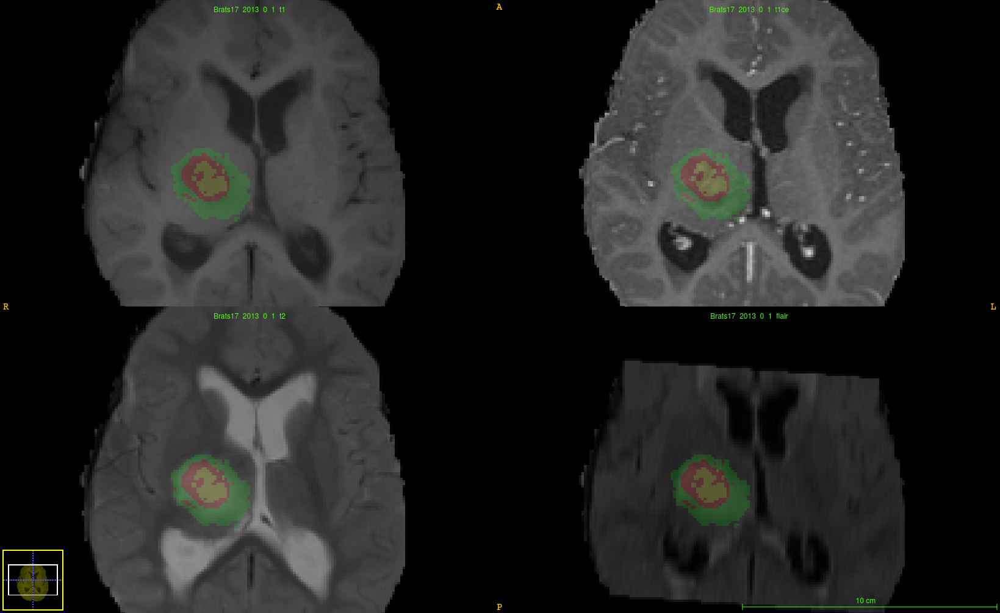
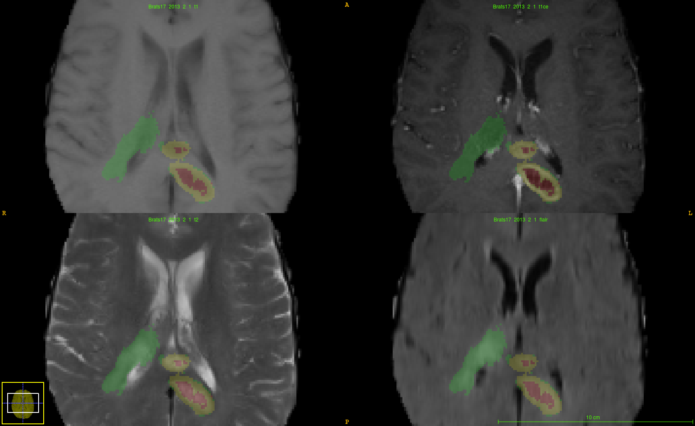

% Multimodal Brain Tumor Segmentation Challenge 2017 (BraTS)
% Mariano Cabezas
% May 11th, 2017

# Example  problem

-  Annotations comprise (Fig1):
    - The whole tumor
    - The tumor core (including cystic areas)
    - The Gd-enhancing tumor core 

# DATA

- Complete original TCIA glioma collections:
    - TCGA-GBM, n=262
    - TCGA-LGG, n=199
- Images acquired with different clinical protocols and various scanners from multiple (n=13) institutions:
    - The native (T1)
    - Post-contrast T1-weighted (T1Gd)
    - T2-weighted (T2)
    - T2 Fluid Attenuated Inversion Recovery (FLAIR)
- All the imaging datasets have been segmented manually, by **one** to **four** raters
- **Participants are not allowed to use additional private data (from their own institutions) for data augmentation**

# Training I
- Images skull-stripped (or cropped)
- LGG, n = 75 (Bad quality)

- All in ftp://xtian.udg.edu:22321

# Training II
- HGG, n = 210 (*Better* quality)

- All in ftp://xtian.udg.edu:22321

# Tasks I
- Task 1: ​​Segmentation of gliomas in pre-operative scans
    - "Enhancing tumor" (ET): hyper-intensity in T1Gd when compared to T1 and “healthy” WM in T1Gd
    - "Tumor core" (TC):  bulk of the tumor (ET + necrotic (fluid-filled) + non-enhancing (solid))
    - "Whole tumor" (WT): complete extent of the disease (TC + peritumoral edema)

# Tasks II
- Task 2: Prediction of patient overall survival (OS) from pre-operative scans
    - Predict a csv file with the subjects ids and the predicted survival values

|Brats17ID|Age|Survival|
|---------|---|--------|
|Brats17_TCIA_167_1|74.907|153|
|Brats17_TCIA_242_1|66.479|147|
|Brats17_TCIA_319_1|64.860|254|
|Brats17_TCIA_469_1|63.899|519|
|Brats17_TCIA_218_1|57.345|346|
|Brats17_TCIA_406_1|78.745|82|
|Brats17_TCIA_280_1|57.362|508|

    
# Deadlines
- Training data availability **(5th May)**
- Validation data availability **(June)**
- Short paper submission: 2-6 LNCS pages validation results **(July)**
- Test Data availability & Performance Evaluation: 48-hour window **(1-21st August)**
- Oral presentations **(14th September)**
- Post-conference LNCS paper: only top-ranked methods for BrainLes Workshop
- Joint post-conference journal paper

