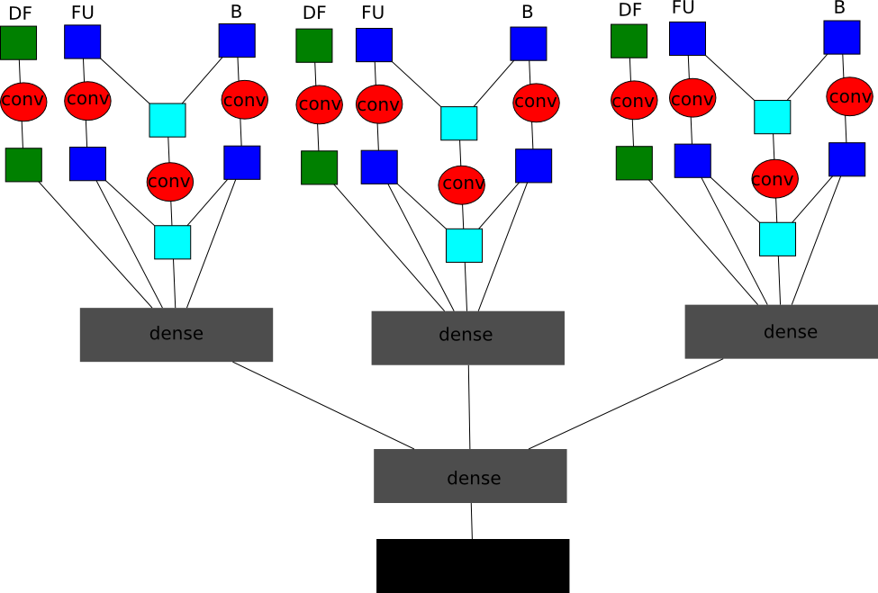
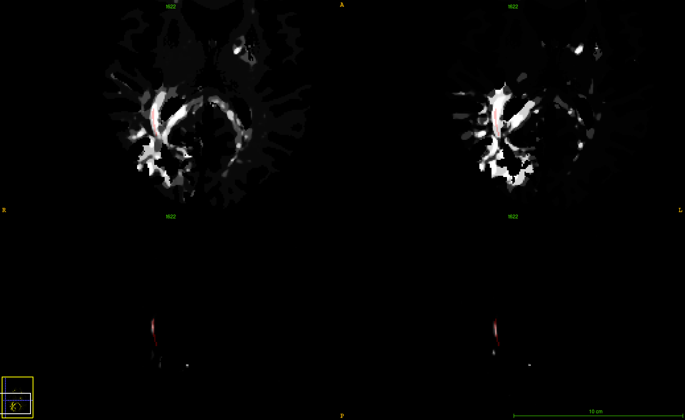

% Longitudinal segmentation
% Mariano Cabezas
% May 11th, 2017

# What I have been doing I
- Cascaded network
- Balanced dataset
- Deformation fields
- PD-2, T2-w, FLAIR
- Subtraction layers

# What I have been doing II

# What I am doing
- Unbalance the second CNN
    - 250k parameters
    - Positives all (10k samples)
    - Negatives all voxels with $p_{lesion} > 0.5$ (250-400k samples)
- "Transfer learning" with unbalanced data
    - 150k parameters
    - Positives all (10k)
    - Negatives from iter 1 + voxels with $p_{lesion} > 0.5$ (250-400k samples)

# Example

# Results
- Still working on it but...
    - A lot of 0.7 segmentation DSC