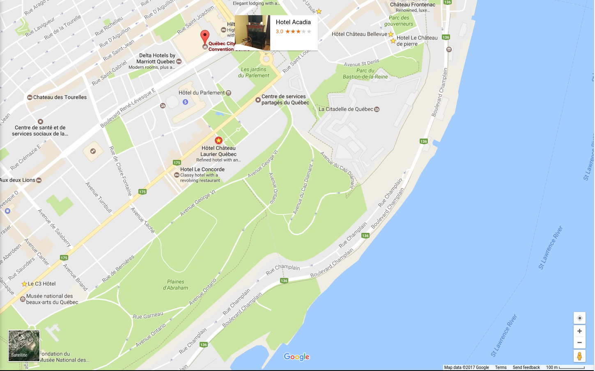

% MICCAI trip (Quebec)
% Mariano Cabezas
% June, 2017

# Air Canada
## To Quebec (Friday 08/09/2017)
- [10:10 hours]

    | Origin                 | Destination            | Flight Number |
    |------------------------|------------------------|---------------|
    | BCN [12:50]            | Montreal (YUL) [15:05] | AC 1915       |
    | Montreal (YUL) [16:10] | Quebec (YQB) [17:00]   | AC 8926       |
    

    | Economic TANGO | Economic FLEX |
    |----------------|---------------|
    | 195 €          | 545 €         |

# Air Canada
## To Barcelona (Saturday 15/09/2017)
-  [8:45 hours (1 day change)]

    | Origin                 | Destination            | Flight Number |
    |------------------------|------------------------|---------------|
    | Quebec (YQB) [19:20]   | Montreal (YUL) [20:07] | AC 8731       |
    | Montreal (YUL) [20:50] | BCN [10:05]            | AC 1912       |

    | Economic TANGO | Economic FLEX |
    |----------------|---------------|
    | 386 €          | 741 €         |

# Hotels (08-15/09/2017)
- Le Chateau de Pierre $\star\star\star$
    - 1 large double bed 801 €
- C3-Hotel Art de Vivre $\star\star\star$
    - Queen room basement 819 €
    - Economy queen room 866 €
- Hotel Chateau Bellevue $\star\star\star$
    - Superior Queen Room 969 (823) €
- Hotel Acadia $\star\star\star$
    - Standard Double Room (Ermitage) 709 €
    - Classic Double Room (Lousbourg) 782 €
    - Classic Double Room (Acadia) 818 €
- Hotel Marie-Rollet $\star\star\star$
    - Standard Queen Room 721 €
- Hotel Chateau Laurier Québec $\star\star\star\star$
    - Business Double Room 855 (794) €

# Hotels location (08-15/09/2017)

