% MICCAI 2017 (some highlights)
% Mariano Cabezas

# Deep learning is the present (I) - DLMIA
- DLMIA workshop ([proceedings](https://link.springer.com/book/10.1007%2F978-3-319-67558-9))
	- Cost functions
	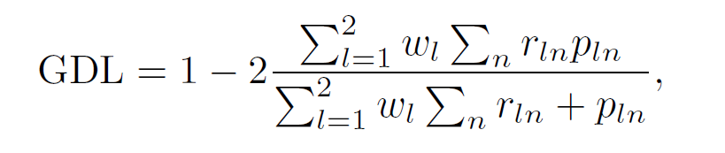{width=20% height=20%}	
	- Cool SIEMENS talk

# Deep learning is the present (II) - Curriculum learning (I)
- From easy samples to harder ones ([CASED: Curriculum Adaptive Sampling for Extreme Data Imbalance, A. Jesson et al.](https://link.springer.com/chapter/10.1007/978-3-319-66179-7_73))

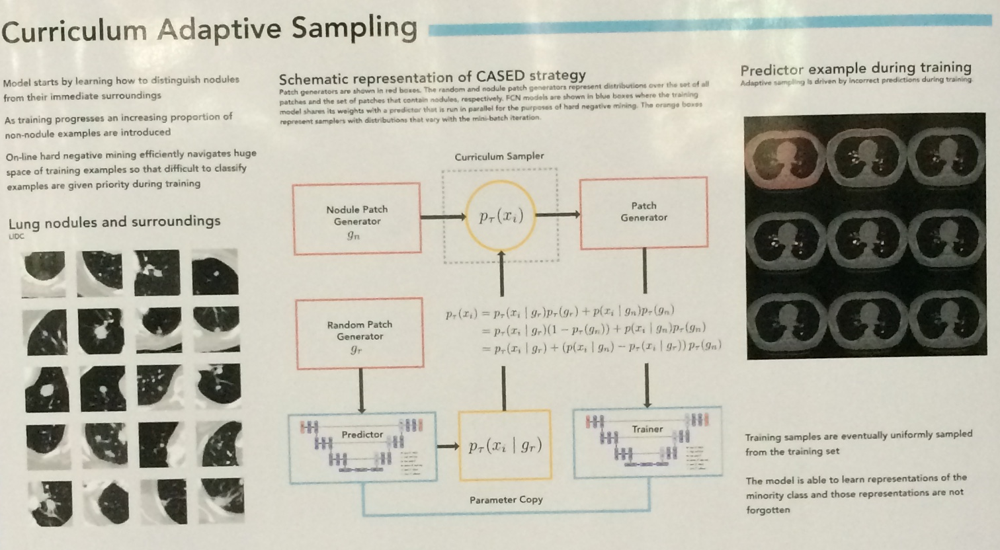{width=30% height=30%}

# Deep learning is the present (II) - Curriculum learning (II)
- Sampling strategies like multi-armed bandit ([A Multi-armed Bandit to Smartly Select a Training Set from Big Medical Data, B. Gutierrez et al.](https://link.springer.com/chapter/10.1007/978-3-319-66179-7_5))

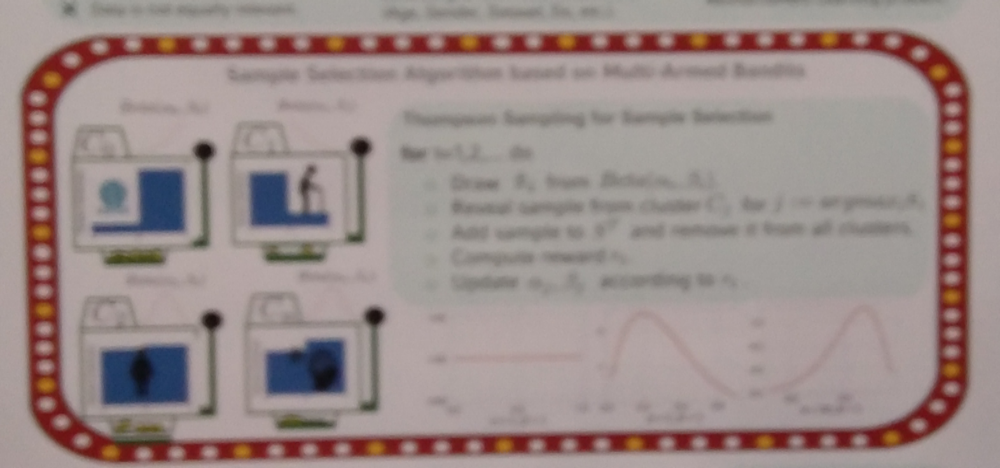{width=30% height=30%}

# Deep learning is the present (III) - Semi-supervised
- Semi-supervised learning using embedding and multiple metrics ([Semi-Supervised Deep Learning for Fully Convolutional Networks, C. Baur](https://link.springer.com/chapter/10.1007/978-3-319-66179-7_36)

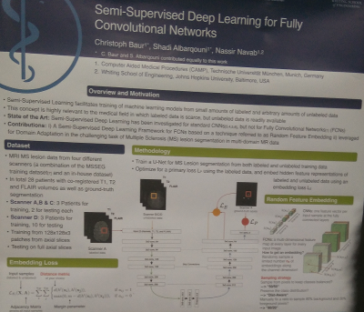{width=30% height=30%}

- Adversarial networks for domain adaptation, denoising, unsupervised/semisupervised learning, ... ([Kamnitsa's presentation](https://github.com/Kamnitsask/presentationsAndTutorials/blob/master/deepLearningMIUA2017/kamnitsasTutorialMIUA17.pptx))

# Deep learning is the present (IV) - GCNN
- Convolutional graph stuff
	- GRAIL 2017 workshop ([proceedings](https://link.springer.com/book/10.1007%2F978-3-319-67675-3), [website](https://biomedic.doc.ic.ac.uk/miccai17-grail/))

	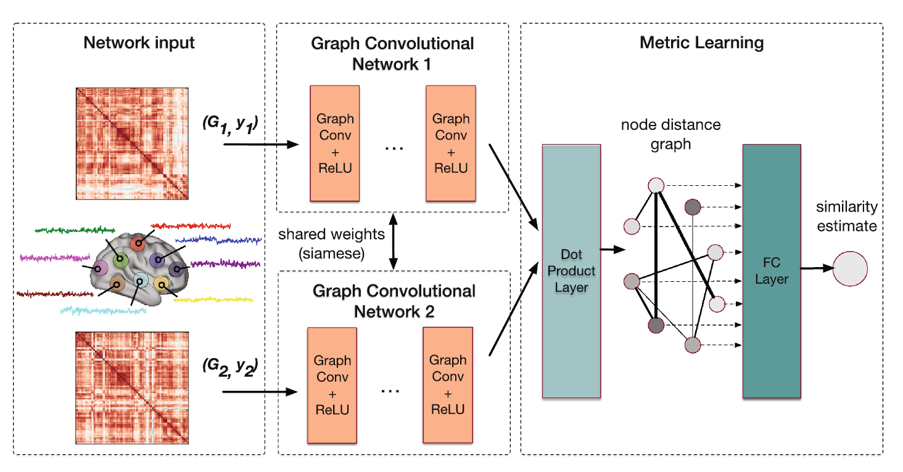{width=30% height=30%}

	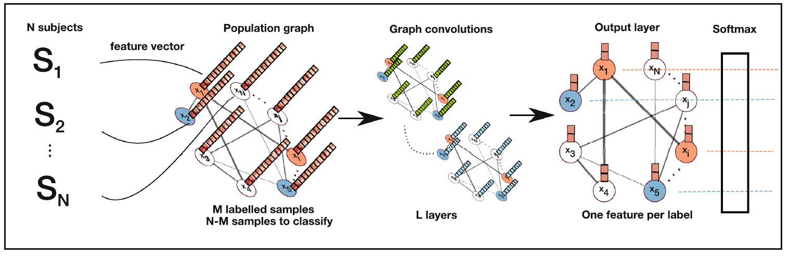{width=30% height=30%}

# Deep learning is the present (V) - Ensembles
- Ensembles of networks
	- Biased subnetwork architectures...
	- Forget hyperparameters and architectures!
	- BraTS pre-proceedings are [here](https://www.cbica.upenn.edu/sbia/Spyridon.Bakas/MICCAI_BraTS/MICCAI_BraTS_2017_proceedings_shortPapers.pdf)

	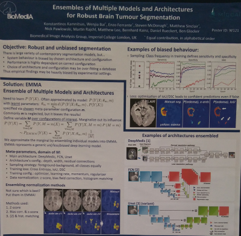{width=30% height=30%}

# Deep learning is the present - Conclusions
- We should move to TensorFlow
	- It has a lot of native layers
	- More versatile for non-convolutional(standard) stuff
- We should not worry about architectures anymore
	- Move to new paradigms (adversarials, sampling stuff, ensembles, cost functions, etc.)
	- Explore uncharted waters!

	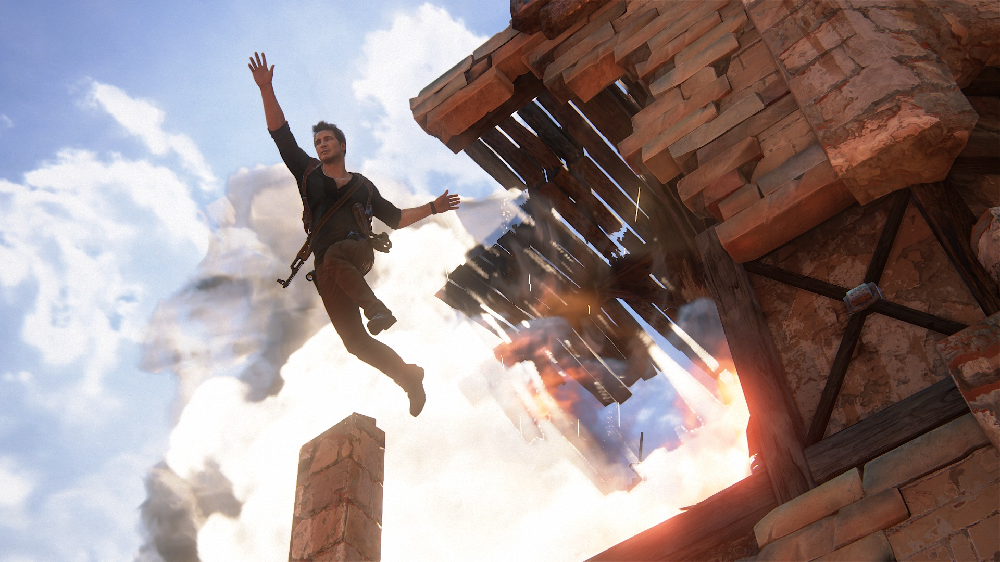{width=30% height=30%}

# The really important stuff! (I)
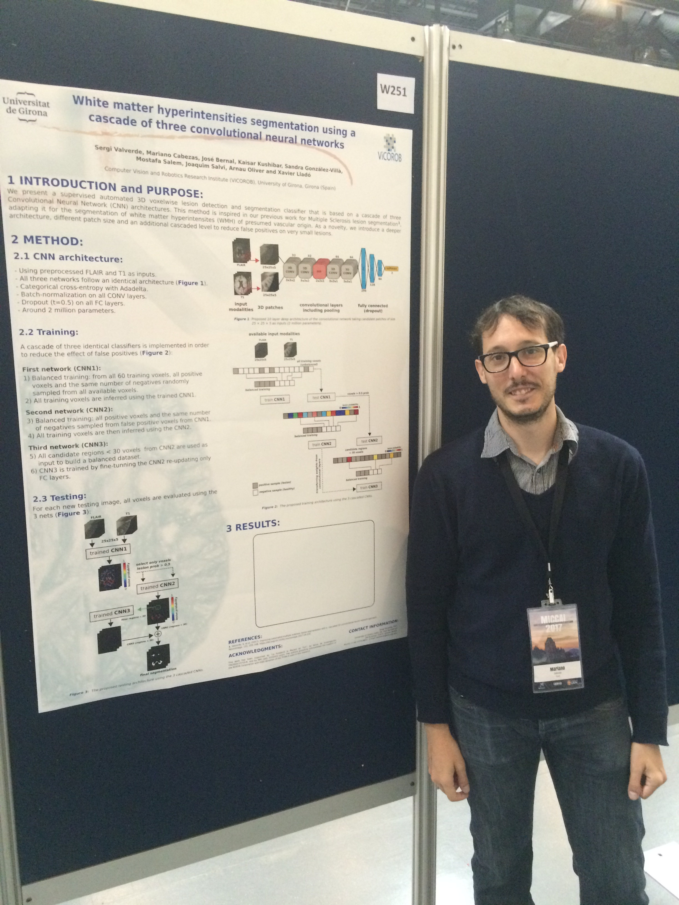{width=40% height=40%}
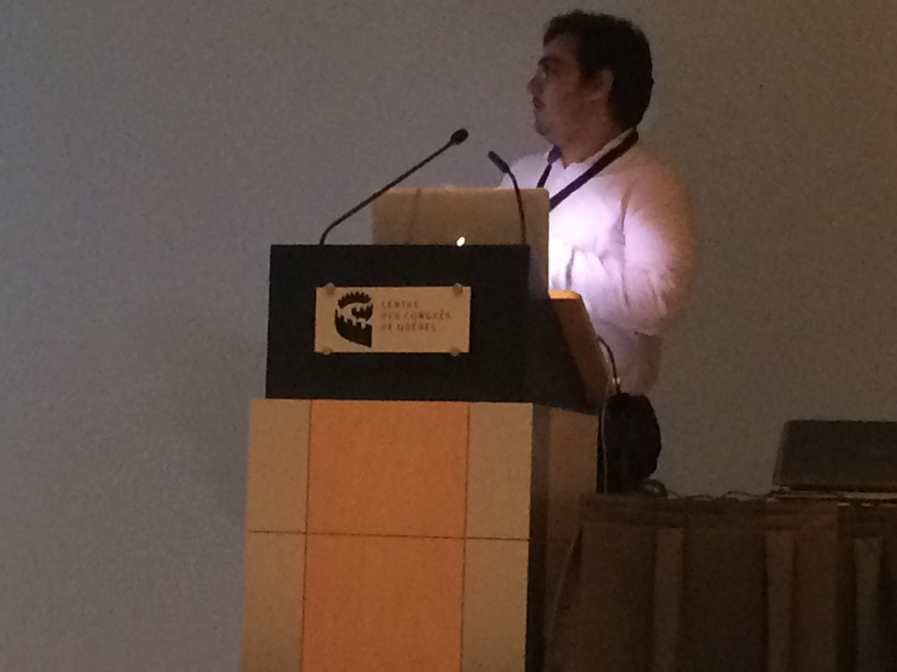{width=40% height=40%}

# The really important stuff! (II)
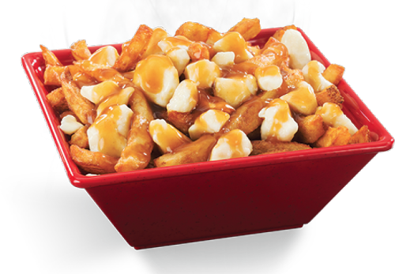{width=50% height=50%}

# The really important stuff! (III)
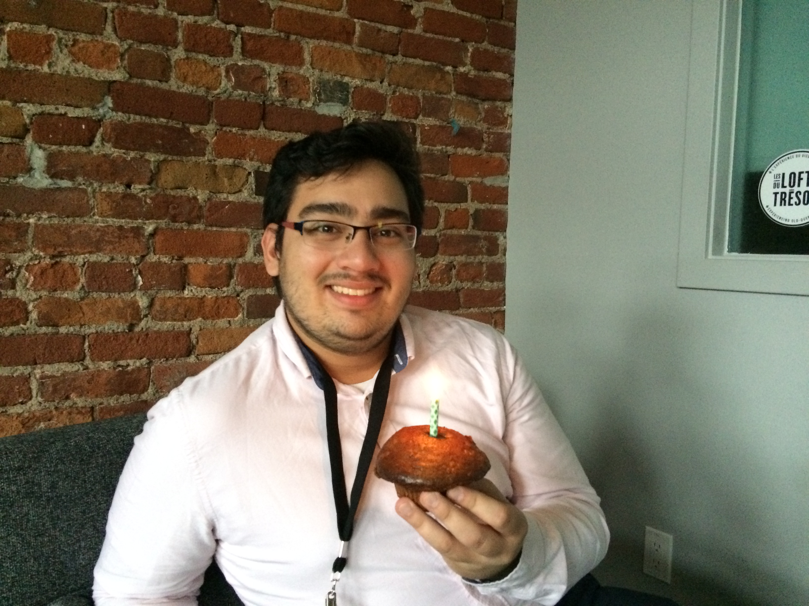

# The really important stuff! (IV)
- Yeah, right... Ok...

{width=30% height=30%} {width=30% height=30%} {width=30% height=30%}

# The really important stuff! (V)
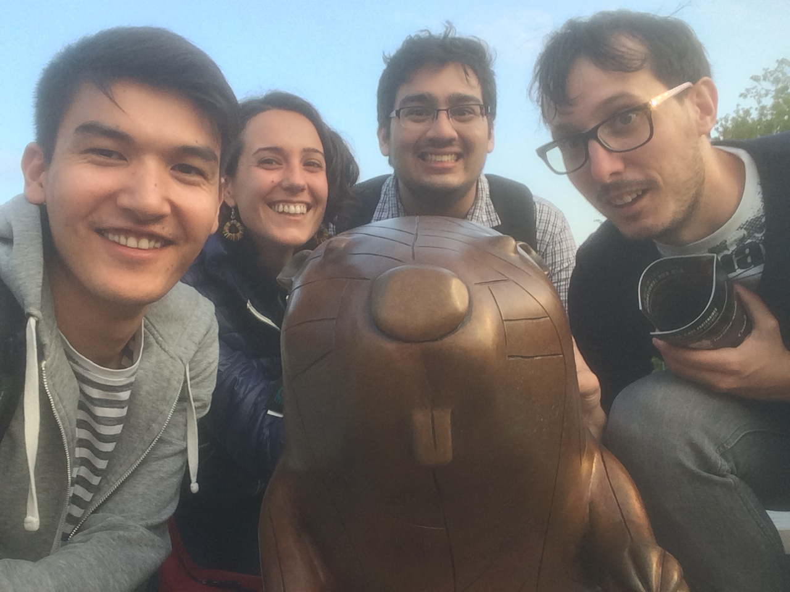
